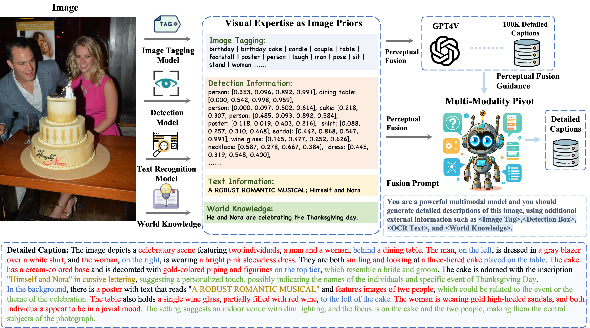

#   DenseFusion-1M: Merging Vision Experts for Comprehensive Multimodal Perception

Official pytorch implementation of **[DenseFusion-1M: Merging Vision Experts for Comprehensive Multimodal Perception](http://arxiv.org/abs/2407.08303)**.
<p align="left">
   📚 <a href="https://arxiv.org/abs/2407.08303" target="_blank">Paper </a>🤗 <a href="https://huggingface.co/datasets/BAAI/DenseFusion-1M" target="_blank">Dataset</a> 
</p>


- **Authors**: [Xiaotong Li](https://scholar.google.com/citations?user=cpCE_T4AAAAJ&hl=zh-CN), [Fan Zhang](https://scholar.google.com/citations?user=VsJ39HMAAAAJ), [Haiwen Diao](https://scholar.google.com/citations?user=46eCjHQAAAAJ&hl=zh-CN), [Yueze Wang](https://openreview.net/profile?id=~Yueze_Wang1), [Xinling Wang](https://scholar.google.com/citations?user=DPz0DjYAAAAJ&hl=zh-CN), [Ling-Yu Duan](https://scholar.google.com/citations?user=hsXZOgIAAAAJ&hl=zh-CN).
- **Institutes**:  Peking University; Beijing Academy of Artificial Intelligence; Dalian University of Technology
- **Dataset**: [🤗[DenseFusion-4V-100K](https://huggingface.co/datasets/BAAI/DenseFusion-1M/blob/main/DenseFusion-4V-100k.jsonl)], [🤗[DenseFusion-1M](https://huggingface.co/datasets/BAAI/DenseFusion-1M/blob/main/DenseFusion-1M.jsonl)]

## 📜 News
[2024/07/12] The [paper](http://arxiv.org/abs/2407.08303) and [dataset](https://huggingface.co/datasets/BAAI/DenseFusion-1M) are released ! 💥   
[2024/07/30] The training recipe and code using DenseFusion-1M are released.    
[2024/08/22] We have uploaded all image zips to Huggingface. This will make it convenient for you to explore and enjoy the dataset.

## 💡 Introduction
- *"An image is worth a thousand words"*. Comprehensive image descriptions are essential for multi-modal perception, while images contains various visual elements of different granularities that are challenging to harness.
- We propose **Perceptural Fusion** to integrate the diverse visual perception experts for capturing visual elements and adopt a MLLM as a centric pivot for comprehensive perception.
- We thereby provide **DenseFusion-1M** dataset for highly informative image descriptions with various visual details, including rich *OCR information*, *accurate object* and *position recognition*, and *external knowledge*, etc.

## 🛸 Method
- Pipeline of *Perceptual Fusion* to acquire DenseFusion dataset with hyper-detailed image descriptions. This pipeline leverages various visual experts as image priors and employs a multimodal model as the central pivot for integrating multi-source information. Its capability is learned from a 100K meta dataset generated by advanced GPT-4V.
<p align="center">
      
</p>


## 📚 Dataset
- We carefully select 1M highly representative images from uncurated LAION dataset through *Semantic Clustering and De-duplication*.
- Through perceptual fusion, we obtain the comprehensive image-text data *DenseFusion-4V-100K* and *DenseFusion-1M*.
- You can download the dataset from the 🤗[Huggingface](https://huggingface.co/datasets/BAAI/DenseFusion-1M) and images can be obtained from the urls using the `./download/download.py`.
- For convenience, we have uploaded all image zips to Huggingface. Enjoy it! (Note that the use of these images must comply with the LAION license.)

|Dataset| Captioned by |Link|
|---|---|---|
|DenseFusion-4V-100K|GPT-4V|🤗[Huggingface](https://huggingface.co/datasets/BAAI/DenseFusion-1M)
|DenseFusion-1M|Ours|🤗[Huggingface](https://huggingface.co/datasets/BAAI/DenseFusion-1M)

- Visual examples from DenseFusion-1M, enriched with various detailed visual elements, such as *OCR information*, *object/attribute information*, *spaital position*, and *external world knowledge*.

<p align="center">
      
</p>


## 🤖 Benchmark Performance
We utilize this highly informative image captions DenseFusion-1M for *Pre-training Stage*. The training code largely follows [LLaVA](https://github.com/haotian-liu/LLaVA) and [ShareGPT4V](https://github.com/ShareGPT4Omni/ShareGPT4V).
- Low-resolution MLLM: [LLaVA](https://github.com/haotian-liu/LLaVA)
- High-resolution MLLM: [LLaVA-S<sup>2</sup>](https://github.com/bfshi/scaling_on_scales)

The high-quality image-text data brings consistent and significant improvements, especially for high-resolution MLLMs that require detailed visual information for effective learning.

| Model | LLM | SQA<sup>I | VQA<sup>v2 | GQA | VQA<sup>T| MME | MMB | SEED<sup>I | POPE | MMVet|
|---|---|---|---|---|---|---|---|---|---|---|
| LLaVA-7B | Vicuna_7B | 66.8 | 78.5 | 62.0 | 58.2 | 1510| 64.3 | 66.2 | 85.9 | 30.5 |
| DenseFusion-7B | Vicuna_7B | 69.3 | 80.8 | 64.0 | 62.0 | 1574 | 69.2 | 70.1 | 86.5 | 37.8 | 
| LLaVA-S<sup>2</sup>-7B | Vicuna_7B | 68.2 | 79.7 | 63.3 | 60.8 | 1520 | 66.4 | 67.2 | 86.7 | 34.6 |
| DenseFusion-S<sup>2</sup>-7B | Vicuna_7B | 72.1 | 81.6 | 65.3 | 67.4 | 1551 | 70.7 | 71.1 | 87.2 | 37.5| 

## Training with DenseFusion-1M
DenseFusion training consists of three stages: (1) feature alignment stage: we first adopt our high-quality DenseFusion-1M to pre-align the MLP connector with a *frozen pretrained* vision encoder and a *frozen LLM*; (2) pre-training stage: we adopt our DesneFusion-1M data for pre-training stage and unfreeze the half of the vision encoder, the MLP connector, and the LLM. (3) visual instruction tuning stage: we adopt the original LLaVA-mix-665K data to teach the model to follow multimodal instructions.

The training scripts are under `/scripts/densefusion`. The pre-trained vision encoder and language model will be automatically download.
- Low-resolution MLLM: we use the architeture of LLaVA-1.5 for Low-resolution MLLM training. You can launch the script throught the following instruction:  
```
bash scripts/densefusion/train.sh ${WORLD_SIZE} ${RANK} ${MASTER_PORT} ${MASTER_ADDR}
```
- High-resolution MLLM: we use the architeture of LLaVA-S2 for High-resolution MLLM training.
You should install `s2wrapper` through pip install, and you can launch the script throught the following instruction:  
```bash
pip install git+https://github.com/bfshi/scaling_on_scales.git
```
```
bash scripts/densefusion/train_s2.sh ${WORLD_SIZE} ${RANK} ${MASTER_PORT} ${MASTER_ADDR}
```

The experiment is trained on 16 A100 GPUs with 40GB memory. The overall training cost around 15 hours. To train on fewer GPUs, you can reduce the `per_device_train_batch_size` and increase the `gradient_accumulation_steps` accordingly. Always keep the global batch size the same: `per_device_train_batch_size` x `gradient_accumulation_steps` x `num_gpus`.

We provide the source data of DenseFusion-1M, you can instruct your own conversations following LLaVA configuration.

## Evaluation

To ensure the reproducibility, we evaluate the models with greedy decoding. We do not evaluate using beam search to make the inference process consistent with the chat demo of real-time outputs. The evaluation follows the implementation of [LLaVA-v1.5](https://github.com/haotian-liu/LLaVA).

See [Evaluation.md](docs/Evaluation.md).


## ❤️ Acknowledgments 
- [LLaVA](https://github.com/haotian-liu/LLaVA), [ShareGPT4V](https://github.com/ShareGPT4Omni/ShareGPT4V): Thanks for their wonderful works and code!
- [Vicuna](https://github.com/lm-sys/FastChat): The amazing open-sourced large language model series!
- [Scales on Scale: S<sup>2</sup>](https://github.com/bfshi/scaling_on_scales): The wonderful project for efficient and effective high-resolution MLLM architecture.
## ✒️ Citation 
If **DenseFusion** is helpful for your research, please consider **star** ⭐ and **citation** 📝 :

```bibtex
@article{li2024DenseFusion,
      title={DenseFusion-1M: Merging Vision Experts for Comprehensive Multimodal Perception}, 
      author={Xiaotong Li and Fan Zhang and Haiwen Diao and Yueze Wang and Xinlong Wang and Ling-Yu Duan},
      year={2024},
      journal={2407.08303
},
```

## 📄 License
The content of this project itself is licensed under [LICENSE](https://github.com/baaivision/DenseFusion/blob/main/LICENSE).
